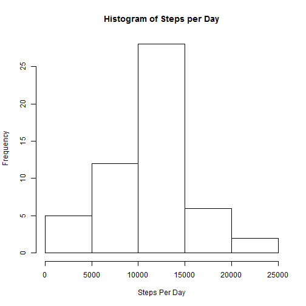
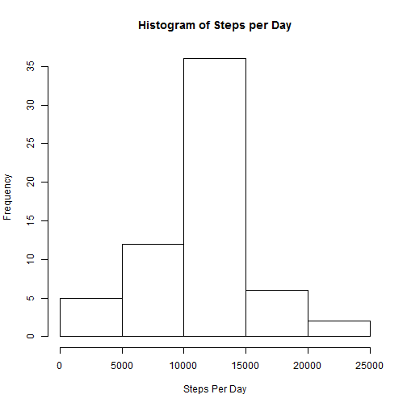
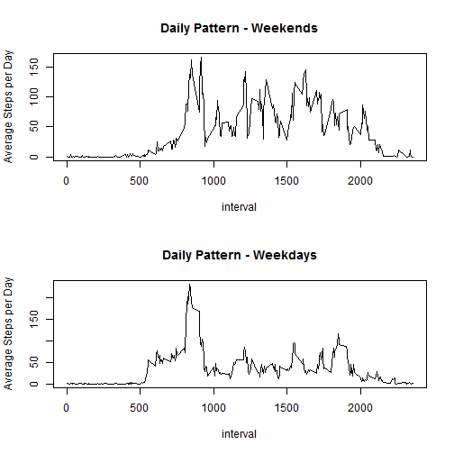

## Loading and preprocessing the data

_The "activity.zip" file is expected to be in the same path as this file._


```r
unzip("./activity.zip");
activity <- read.csv("activity.csv");
stepsPerDay <- aggregate(activity$steps, by = list(date=activity$date), sum);
dailyPattern <- aggregate(activity$steps, by = list(interval=activity$interval), mean, na.rm=TRUE);
```

## What is mean total number of steps taken per day?

Histogram of Steps per Day


```r
hist(stepsPerDay$x, xlab="Steps Per Day", main="Histogram of Steps per Day");
```

 

Mean and median of number of steps taken everyday


```r
mean(stepsPerDay$x, na.rm=TRUE);
```

```
## [1] 10766.19
```

```r
median(stepsPerDay$x, na.rm=TRUE);
```

```
## [1] 10765
```

## What is the average daily activity pattern?


```r
plot(dailyPattern$interval, dailyPattern$x, type="l", xlab="Interval", ylab="Average Number of Steps");
```

 

```r
with(dailyPattern, interval[x == max(x)]);
```

```
## [1] 835
```

## Imputing missing values

Number of records with missing values (in the "steps" column)


```r
length(activity$steps[is.na(activity$steps)]);
```

```
## [1] 2304
```

To impute, a copy of the original data is being made and missing values are assumed to be the average number of steps for that interval across all days


```r
activityCopy <- activity;
for(i in 1:length(activityCopy[,1])) {
	if(is.na(activityCopy[i,1])) {
		activityCopy[i,1] <- dailyPattern[activityCopy[i,3] == dailyPattern[,1], 2];
	}
}
```

Histogram of Steps per Day


```r
stepsPerDayCopy <- aggregate(activityCopy$steps, by = list(date=activityCopy$date), sum);
hist(stepsPerDayCopy$x, xlab="Steps Per Day", main="Histogram of Steps per Day");
```

 

Mean and median of number of steps taken everyday (after imputing)


```r
mean(stepsPerDayCopy$x, na.rm=TRUE);
```

```
## [1] 10766.19
```

```r
median(stepsPerDayCopy$x, na.rm=TRUE);
```

```
## [1] 10766.19
```

## Are there differences in activity patterns between weekdays and weekends?

Add a "dayType" field to represent weekend/weekday


```r
activityCopy$date <- as.Date(activityCopy$date, "%Y-%m-%d");
activityCopy$dayType <- with(activityCopy,
	ifelse(weekdays(date) == "Sunday", "weekend", ifelse(weekdays(date) == "Saturday", "weekend", "weekday"))
);
```

Draw a 2x1 panel plot of weekend pattern and weekday pattern


```r
dailyPatternDayType = aggregate(activityCopy$steps, by=list(dayType=activityCopy$dayType, interval=activityCopy$interval), mean, na.rm=TRUE);
par(mfrow=c(2,1));
with(dailyPatternDayType[dailyPatternDayType$dayType == "weekend",],
	plot(interval, x, type="l", main="Daily Pattern - Weekends", ylab="Average Steps per Day")
);
with(dailyPatternDayType[dailyPatternDayType$dayType == "weekday",],
	plot(interval, x, type="l", main="Daily Pattern - Weekdays", ylab="Average Steps per Day")
);
```

 
